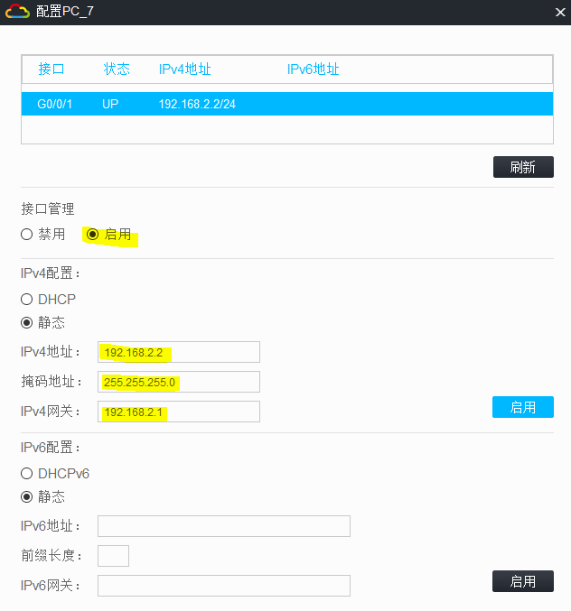
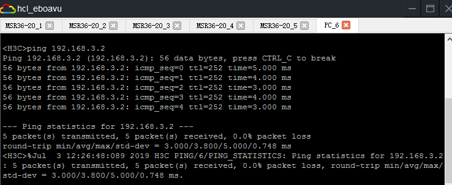
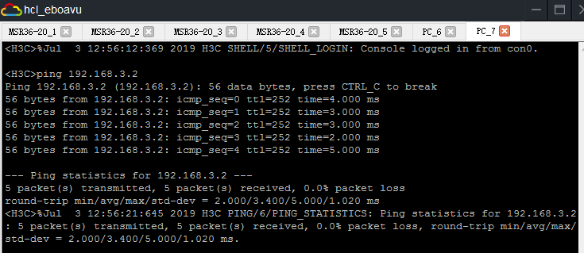

## 静态路由实验
---

### 实验拓扑


---

### 实验需求

1.按照图示配置 IP 地址
1.按照如下路径规划配置静态路由，实现连接 PC 的业务网段互通
      (1)`192.168.1.0/24` 网段到达 `192.168.2.0/24` 网段经过 R1，R2，R3
      (2)`192.168.2.0/24` 网段到达 `192.168.1.0/24` 网段经过 R3，R4，R1
      (3)`192.168.1.0/24` 网段到达 `192.168.3.0/24` 网段经过 R1，R4，R5
      (4)`192.168.2.0/24` 网段到达 `192.168.3.0/24` 网段经过 R3，R4，R5
      (5)`192.168.3.0/24` 网段到达 `192.168.1.0/24` 网段和 `192.168.2.0/24` 网段的路由来回一致
      (6)R5 上不允许出现到达其他业务网段的明细路由
      (7)所有经过 R4 和 R5 的流量通过等价路由实现负载分担

---

### 实验解法

1.**按拓扑图配置 IP 地址**

*步骤 1：配置PC6的IP地址为192.168.1.2/24，网关为192.168.1.1*


*步骤 2：配置PC7的IP地址为192.168.2.2/24，网关为192.168.2.1*



*步骤 3：配置PC8的IP地址为192.168.3.2/24，网关为192.168.3.1*


*步骤 4：配置R1的接口IP*
```
[R1]int g0/2
[R1-GigabitEthernet0/2]ip address 192.168.1.1 24
[R1-GigabitEthernet0/2]int g0/0
[R1-GigabitEthernet0/0]ip address 10.2.2.1 24
[R1-GigabitEthernet0/0]int g0/1
[R1-GigabitEthernet0/1]ip address 10.1.1.1 24
```
*步骤 5：配置R2的接口IP*
```
[R2]int g0/0
[R2-GigabitEthernet0/0]ip address 10.2.2.2 24
[R2-GigabitEthernet0/0]int g0/1
[R2-GigabitEthernet0/1]ip address 10.3.3.2 24
```
*步骤 6：配置R3的接口IP*
```
[R3]int g0/1
[R3-GigabitEthernet0/1]ip address 10.4.4.3 24
[R3-GigabitEthernet0/1]int g0/0
[R3-GigabitEthernet0/0]ip address 10.3.3.3 24
[R3-GigabitEthernet0/0]int g0/2
[R3-GigabitEthernet0/2]ip address 192.168.2.1 24
```
*步骤 7：配置R4的接口IP*
```
[R4]int g0/0
[R4-GigabitEthernet0/0]ip address 10.1.1.4 24
[R4-GigabitEthernet0/0]int g0/1
[R4-GigabitEthernet0/1]ip address 10.4.4.4 24
[R4-GigabitEthernet0/1]int g0/2
[R4-GigabitEthernet0/2]ip address 10.6.6.4 24
[R4-GigabitEthernet0/2]int g5/0
[R4-GigabitEthernet5/0]ip address 10.5.5.4 24
```
*步骤8：配置R5的接口IP*
```
[R5]int g0/1
[R5-GigabitEthernet0/1]ip address 10.5.5.5 24
[R5-GigabitEthernet0/1]int g0/0
[R5-GigabitEthernet0/0]ip address 10.6.6.5 24
[R5-GigabitEthernet0/0]int g0/2
[R5-GigabitEthernet0/2]ip address 192.168.3.1 24
```

2.**按照需求配置静态路由，实现连接 PC 的业务网段互通**

*步骤 1：配置 `192.168.1.0/24` 网段到 `192.168.2.0` 网段的静态路由*
```
[R1]ip route-static 192.168.2.0 24 10.2.2.2
```
```
[R2]ip route-static 192.168.2.0 24 10.3.3.3
```

*步骤 2：配置 `192.168.2.0/24` 网段到 `192.168.1.0` 网段的静态路由*
```
[R3]ip route-static 192.168.1.0 24 10.4.4.4
```
```
[R4]ip route-static 192.168.1.0 24 10.1.1.1
```

*步骤 3：配置 `192.168.1.0/24` 网段到 `192.168.3.0` 网段的静态路由*
```
[R1]ip route-static 192.168.3.0 24 10.1.1.4
```
```
[R4]ip route-static 192.168.3.0 24 10.5.5.5
[R4]ip route-static 192.168.3.0 24 10.6.6.5
```

*步骤 4：配置 `192.168.2.0/24` 网段到 `192.168.3.0` 网段的静态路由*
```
[R3]ip route-static 192.168.3.0 24 10.4.4.4
```

*步骤 5：配置 `192.168.3.0/24` 网段到 `192.168.1.0` 网段的静态路由*
```
[R5]ip route-static 0.0.0.0 0 10.5.5.4
[R5]ip route-static 0.0.0.0 0 10.6.6.4
```

*步骤 6：配置 `192.168.3.0/24` 网段到 `192.168.2.0` 网段的静态路由*
```
[R4]ip route-static 192.168.2.0 24 10.4.4.3
```
3.**验证PC之间的连通性**

*步骤 1：在PC6上pingPC7,发现可以ping通*


*步骤 2：在PC6上pingPC8,发现可以ping通*



*步骤 3：在PC7上pingPC8,发现可以ping通*


