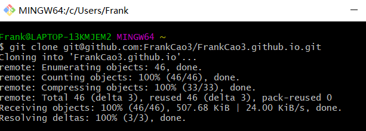
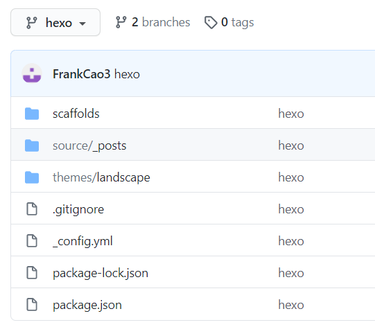

# 利用hexo+gitHub搭建个人博客
---
Hexo是一个基于nodejs 的静态博客网站生成器，为了实现远程访问，我们将其部署在github上面。
重要的一点是，由于部署在github上时，只会在github上生成静态网页文件，而不上传hexo的配置文件、主题以及自己写的markdown文件，所以换新电脑时如果旧电脑的这些文件丢失，就无法重新部署了。所以为了解决这个问题，本次增加一个该项目仓库的分支，即使用2个分支master和hexo，用master来存储网页静态文件，用hexo来存放hexo环境和网站源文件。
   
   

## 一、利用hexo在本地搭建博客
---
### （一）环境配置
1. node.js的安装，在官网直接下载安装即可。
[https://nodejs.org/](https://nodejs.org/)
npm已被包含在 node.js 中，输入`node -v`和`npm -v`检查安装是否成功。


2. git的安装配置。
安装可参考廖雪峰的网站[https://www.liaoxuefeng.com/wiki/896043488029600/896067074338496](https://www.liaoxuefeng.com/wiki/896043488029600/896067074338496)
安装完成后，记得生成SSH key并添加到github。
打开git bash，然后在默认目录下创建.ssh文件夹，在该文件夹下生成ssh密钥，命令为`ssh-keygen -t rsa -C “yourEmail”`。然后可以看到文件夹下出现了2个文件，id_rsa和id_ras.pub，分别为私钥和公钥。最后将id_ras.pub的内容复制，添加到github的SSH key。

### （二）安装hexo框架
1. 借助npm搭建镜像，但是利用其国内镜像会很慢，所以先利用npm安装 cnpm来保证访问速度，这里用淘宝的源，`npm install -g cnpm --registry=https://registry.npm.taobao.org`，-g代表全局安装。用`cnpm -v`检查安装是否成功。

2. 利用 cnpm安装 hexo框架，命令为`cnpm install -g hexo-cli`，用`hexo -v`检查安装是否成功。

3. 建站。创建自己博客的目录，我的是D:\blogs，然后在该目录下操作。命令`hexo init`，初始化hexo。

4. 启动hexo，命令为`hexo server`，访问其默认的本地地址`localhost:4000`可查看博客。

### （三）在本地写博客
1. hexo搭建好之后，打开git bash使用 `hexo new "name"`创建一篇md文章，默认地址为`D:\blogs\source\_posts\`，可以进入该目录找到新建的文章，然后对其进行编辑。
2. 编辑完成后，`hexo clean` 清除缓存，`hexo generate`生成静态文件，`hexo server`启动服务，再次访问localhost:4000可查看文章变动。

## 二、将博客部署到github上
---
1. 首先在github上创建个人仓库，命名必须是`用户名.github.io`。
2. 在`D:\blogs`目录下，安装部署git的插件，`cnpm install --save hexo-deployer-git`。
3. deploy配置。在blogs目录下，修改_config.yml，配置deploy属性，type为git，repo为刚才新建的个人仓库的地址，branch为master（master分支下的文件由hexo命令管理）。（注意冒号后面有空格）

4. 部署和编辑博客。用命令 `hexo deploy`部署博客。部署好之后就可以在本地`hexo new "name"`写好博客，然后`hexo g`，`hexo d`完成上传了。
5. 至此博客其实就可以正常使用了，但是正如本文开篇的考虑，我们需要进一步完善，所以继续看一下内容。

## 三、在仓库新增hexo分支
---
参考文档：[https://www.jianshu.com/p/153490a029a5](https://www.jianshu.com/p/153490a029a5)

1. 在博客项目上新建一个分支，命名为hexo，并设置为默认分支。

然后打开git bash，在任意目录下，执行`git clone git@github.com:FrankCao3/FrankCao3.github.io.git`，将其克隆到本地，因为默认分支已经设成了hexo，所以clone时只clone了hexo。

接下来在克隆到本地的`FrankCao3.github.io`中，把除了.git 文件夹外的所有文件都删掉，再把之前我们写的博客源文件全部复制过来，除了`.deploy_git`。
然后在该目录下，执行如下命令。
```
git add .   #保存所有文件到暂存区
git commit –m "add branch"   #提交变更,""中为注释
git push   #推送到github，这里默认分支已设置为hexo，所以修改的是hexo
```
执行成功后可以在github上看hexo分支下文件有没有上传上去，其中`node_modules`、`public`、`db.json`已经被忽略掉了，没有关系，它们不需要上传的，因为在别的电脑上需要重新输入命令安装 。
这样hexo分支下就存放好了博客网站的配置文件和markdown源文件。


## 四、更换电脑时的操作
1. 先完成环境配置，安装node.js和git，记得生成和添加SSH key。然后安装hexo框架。以上步骤可以参考本文从开始到一（二）2节的内容。
2. 安装好hexo框架后，不需要init，在自定义的目录下执行`git clone git@github.com:FrankCao3/FrankCao3.github.io.git`，直接克隆hexo分支下的文件，这样hexo的配置文件和源文件就下载下来了。然后进入这个FrankCao3.github.io文件夹，执行`npm install`，`npm install hexo-deployer-git --save`，然后`hexo g`，`hexo d`，完成hexo的生成部署。
3. 接下来就可以正常写博客了。

## 五、写博客并提交到github
1. 在`D:\blogs`目录下，在本地hexo分支下打开git bash执行`hexo new "name"`新建博客并编辑。
2. 上传源文件。要注意的是，由于前面使用了第2个分支hexo来存放源文件，所以我们先上传源文件，执行如下命令。
```
git add .   #保存所有文件到暂存区
git commit –m "new blog"   #提交变更，""中为注释
git push    #推送到github，这里默认分支已设置为hexo，所以修改的是hexo
```
3. 执行`hexo g`，`hexo d`提交。（github中master分支下的文件由hexo命令管理）


